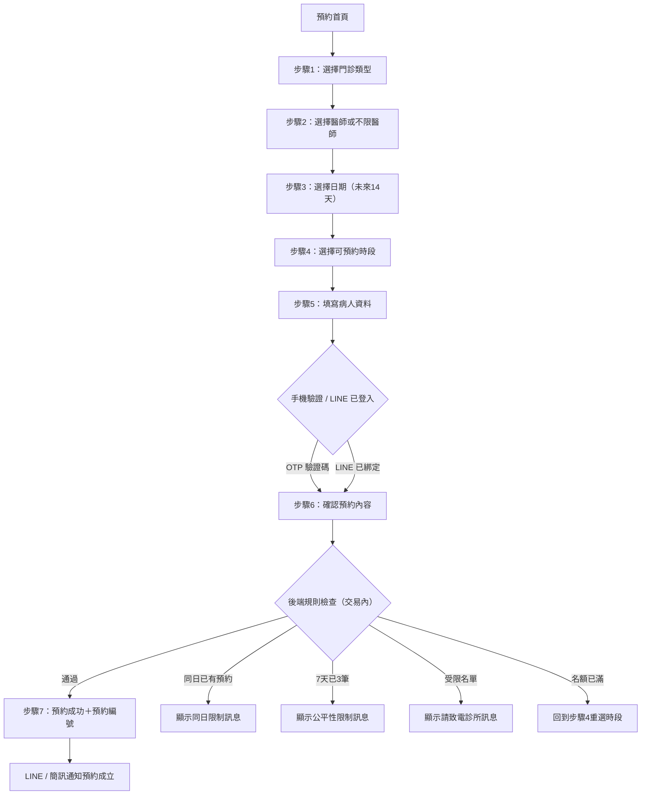
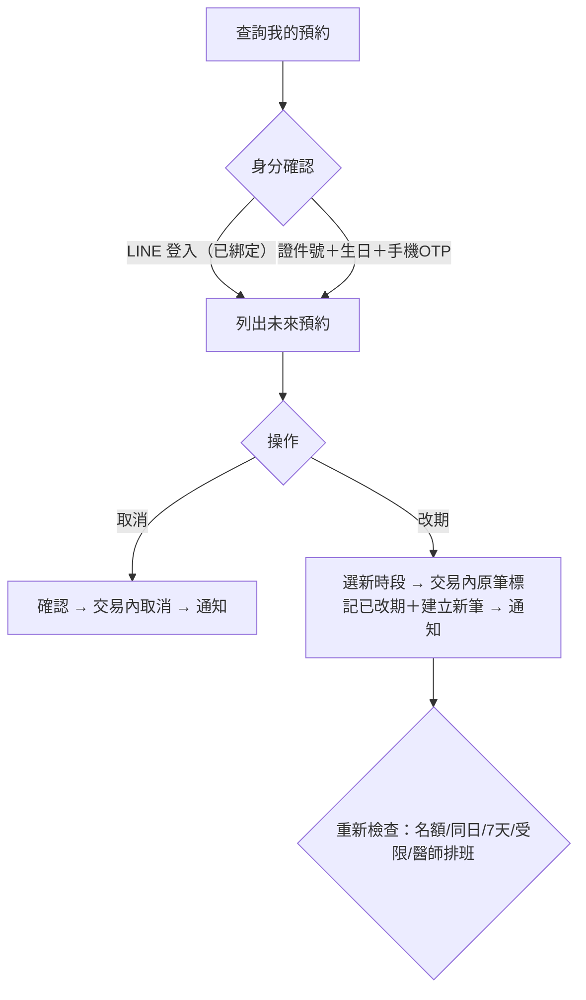
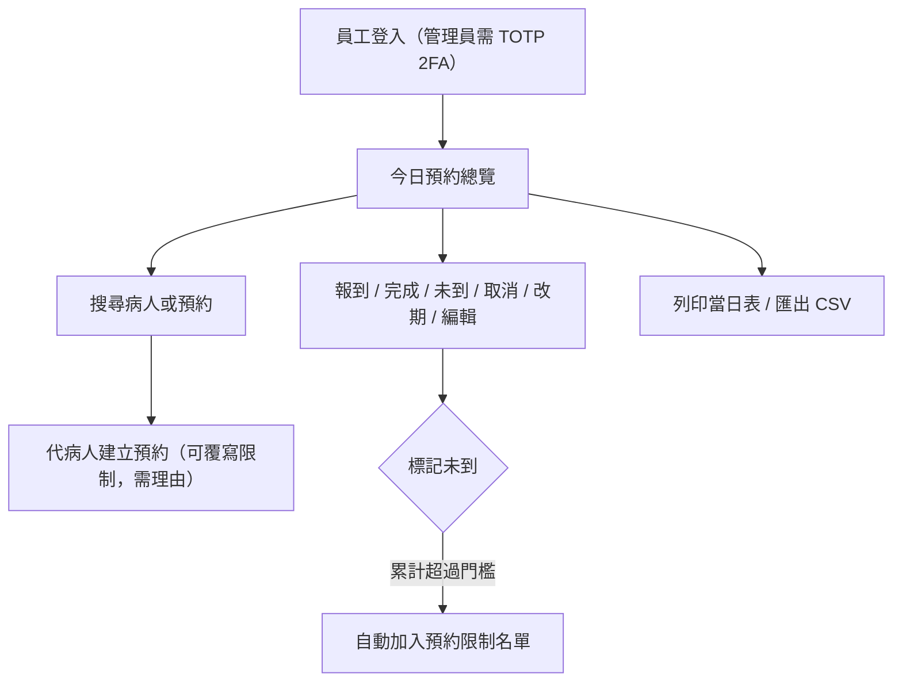
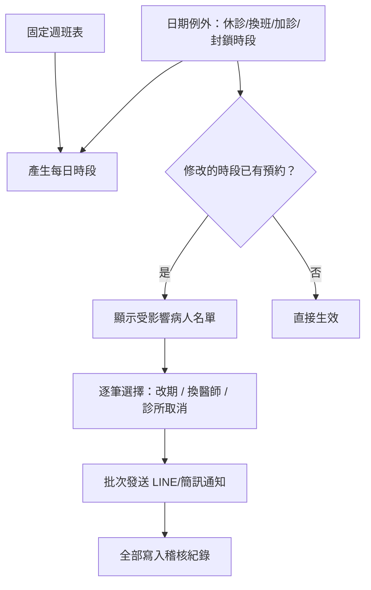

# 02｜前台與後台使用流程

## 一、民眾預約流程（前台）

- 每一步顯示進度條，可返回上一步；送出使用一次性 token 防重複送出。
- 「不限醫師」由系統自動分配仍有名額的醫師，優先平衡各醫師人數。
- 所有規則檢查在**後端交易內**再次執行，前端檢查僅為體驗提示。

## 二、查詢／取消／改期

- 取消與改期受後台設定的截止時間限制（預設看診前 2 小時）。
- 改期為單一交易：新時段檢查失敗時原預約完全不動。

## 三、櫃檯日常流程（後台）

## 四、排班調整流程

## 五、未到與黑名單

1. 櫃檯於總覽將預約標記「未到」→ 寫入 `no_show_records`。
2. 累計超過門檻（預設 3 次）→ 自動建立 `booking_restrictions`（AUTO_NO_SHOW）。
3. 受限病人前台預約時顯示中性訊息（不出現「黑名單」字樣）。
4. 管理員可解除／暫時解除（設定到期日）／重設次數，均需原因＋稽核紀錄。
5. 櫃檯仍可替受限病人代約，需輸入理由。

## 六、通知時機

| 事件 | LINE 推播 | 簡訊（無 LINE 時） |
|---|---|---|
| 預約成立 | ✅ | ✅ |
| 預約修改／改期 | ✅ | ✅ |
| 預約取消（病人／診所） | ✅ | ✅ |
| 前一日提醒（預設 19:00） | ✅ | ✅ |
| 當日提醒（預設 08:00，可關） | ✅ | 後台開關 |
| 臨時休診／調班 | ✅（批次） | ✅（批次） |

通知內容一律不含完整身分證字號與敏感醫療資訊。
