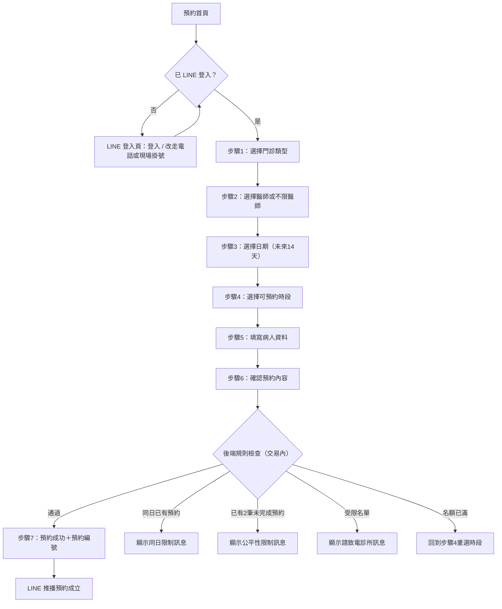
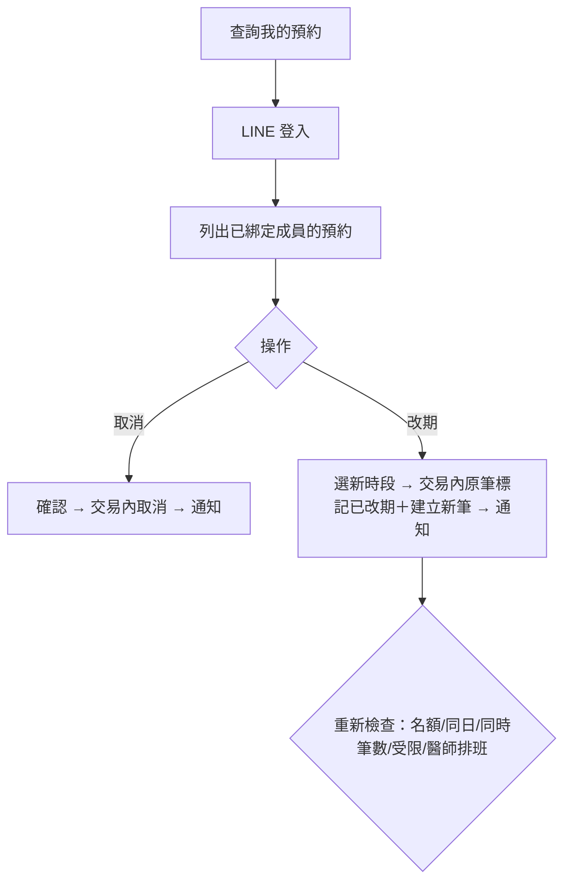
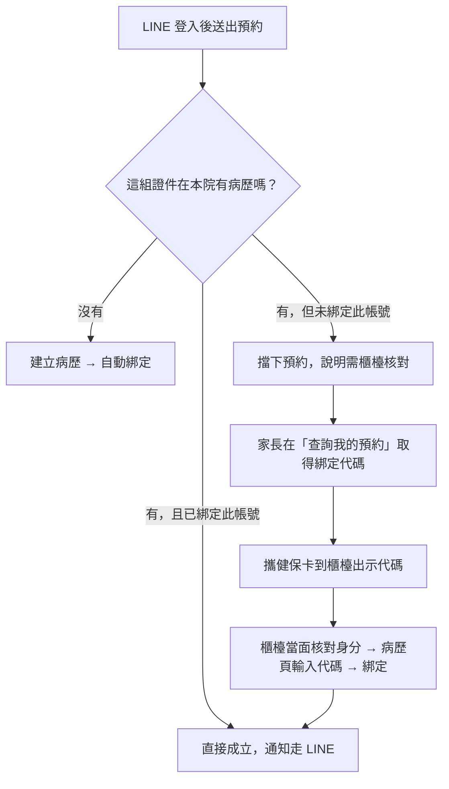
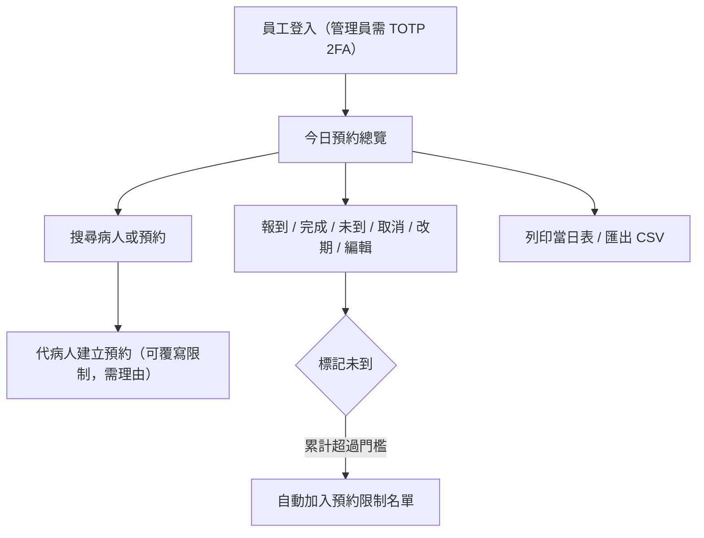
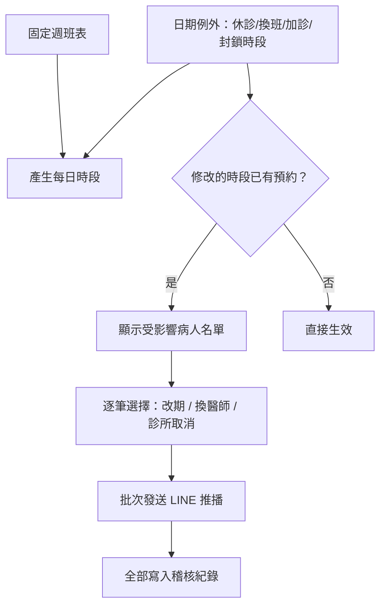

# 02｜前台與後台使用流程

## 一、民眾預約流程（前台）

```mermaid
flowchart TD
    A[預約首頁] --> Z{已 LINE 登入？}
    Z -->|否| Y[LINE 登入頁：登入 / 改走電話或現場掛號]
    Y --> Z
    Z -->|是| B[步驟1：選擇門診類型]
    B --> C[步驟2：選擇醫師或不限醫師]
    C --> D[步驟3：選擇日期（未來14天）]
    D --> E[步驟4：選擇可預約時段]
    E --> F[步驟5：填寫病人資料]
    F --> H[步驟6：確認預約內容]
    H --> I{後端規則檢查（交易內）}
    I -->|通過| J[步驟7：預約成功＋預約編號]
    I -->|同日已有預約| K[顯示同日限制訊息]
    I -->|已有2筆未完成預約| L[顯示公平性限制訊息]
    I -->|受限名單| M[顯示請致電診所訊息]
    I -->|名額已滿| N[回到步驟4重選時段]
    J --> O[LINE 推播預約成立]
```

- **身分擋在最前面**：LINE 登入會離開本頁，若擺在最後一步，家長填完七頁才被導走、
  回來時輸入全失。因此未登入時精靈根本不開始。
- 每一步顯示進度條，可返回上一步；送出使用一次性 token 防重複送出。
- 「不限醫師」由系統自動分配仍有名額的醫師，優先平衡各醫師人數。
- 所有規則檢查在**後端交易內**再次執行，前端檢查僅為體驗提示。

## 二、查詢／取消／改期

```mermaid
flowchart TD
    A[查詢我的預約] --> B[LINE 登入]
    B --> C[列出已綁定成員的預約]
    C --> D{操作}
    D -->|取消| E[確認 → 交易內取消 → 通知]
    D -->|改期| F[選新時段 → 交易內原筆標記已改期＋建立新筆 → 通知]
    F --> G{重新檢查：名額/同日/同時筆數/受限/醫師排班}
```

- 取消與改期以**該診次開診時間**為界（開診後不能自行取消，與官網公告一致），
  **一律以診次為單位、不另看個別時段的時間**（院長 2026-08-06 確認）。
  查不到診次時退回設定的分鐘數備援。詳見 `04`。
- 改期為單一交易：新時段檢查失敗時原預約完全不動。
- **看得到誰的預約，完全取決於 LINE 綁定**（見下一節）。

## 二之二、LINE 綁定：誰能看到誰的預約

綁定＝該 LINE 帳號從此看得到這位病人的**所有**預約紀錄，所以只有兩個來源：

```mermaid
flowchart TD
    A[LINE 登入後送出預約] --> B{這組證件在本院有病歷嗎？}
    B -->|沒有| C[建立病歷 → 自動綁定]
    B -->|有，且已綁定此帳號| D[直接成立，通知走 LINE]
    B -->|有，但未綁定此帳號| E[擋下預約，說明需櫃檯核對]
    E --> F[家長在「查詢我的預約」取得綁定代碼]
    F --> G[攜健保卡到櫃檯出示代碼]
    G --> H[櫃檯當面核對身分 → 病歷頁輸入代碼 → 綁定]
    H --> D
```

- **自助綁定既有病歷的路已經拿掉**（院長 2026-08-15 裁示）。證件號、生日、手機
  這三項知道的人不只本人（家屬、學校、外流名單都可能有），拿來當關卡等於讓人
  冒用證件綁走病歷身分。**核對身分這件事只有櫃檯做得到，程式代替不了。**
- 同行家人若是這次預約才建檔，也一併綁定——否則下次單獨替那位家人預約會被
  自己的規則擋死，等於系統挖坑給家長跳。
- 綁定代碼：6 碼、30 分鐘、一次性，資料表只存雜湊。櫃檯輸入端有限流。
- 櫃檯每次綁定／解除都寫入稽核（誰、什麼時候、綁了誰）。

> **切換上線當天不會卡住**：正式資料庫是全新的，沒有任何病歷，
> 所有家長的第一次線上預約都會建檔並自動綁定。需要櫃檯核對的只有
> 「櫃檯代約或現場掛號先建了檔、家長之後才想改用線上預約」這種情形。

## 三、櫃檯日常流程（後台）

```mermaid
flowchart TD
    A[員工登入（管理員需 TOTP 2FA）] --> B[今日預約總覽]
    B --> C[報到 / 完成 / 未到 / 取消 / 改期 / 編輯]
    B --> D[搜尋病人或預約]
    D --> E[代病人建立預約（可覆寫限制，需理由）]
    C --> F{標記未到}
    F -->|累計超過門檻| G[自動加入預約限制名單]
    B --> H[列印當日表 / 匯出 CSV]
```

## 四、排班調整流程

```mermaid
flowchart TD
    A[固定週班表] --> B[產生每日時段]
    C[日期例外：休診/換班/加診/封鎖時段] --> B
    C --> D{修改的時段已有預約？}
    D -->|是| E[顯示受影響病人名單]
    E --> F[逐筆選擇：改期 / 換醫師 / 診所取消]
    F --> G[批次發送 LINE 推播]
    D -->|否| H[直接生效]
    G --> I[全部寫入稽核紀錄]
```

## 五、未到與黑名單

1. 櫃檯於總覽將預約標記「未到」→ 寫入 `no_show_records`。
2. 累計超過門檻（預設 3 次）→ 自動建立 `booking_restrictions`（AUTO_NO_SHOW）。
3. 受限病人前台預約時顯示中性訊息（不出現「黑名單」字樣）。
4. 管理員可解除／暫時解除（設定到期日）／重設次數，均需原因＋稽核紀錄。
5. 櫃檯仍可替受限病人代約，需輸入理由。

## 六、通知時機

**院長 2026-08-13 裁示：取消簡訊通知與簡訊系統商合作，全部改為 LINE。**

| 事件 | LINE 推播 |
|---|---|
| 預約成立 | ✅ |
| 預約修改／改期 | ✅ |
| 預約取消（病人／診所） | ✅ |
| 前一日提醒（**20:00**，唯一一次） | ✅ |
| ~~當日提醒~~（院長 2026-08-05 裁示關閉，後台可再開） | — |
| 臨時休診／調班 | ✅（批次） |

**沒有 LINE 綁定的預約不排入通知**（例如櫃檯電話代約、或家長封鎖了官方帳號）：
沒有可送達的管道，排進佇列只會變成一筆永遠失敗的紀錄。這類預約由櫃檯當場口頭告知，
臨時休診則由櫃檯逐筆電話聯絡。

通知內容一律不含完整身分證字號與敏感醫療資訊，**也不含預約編號**（院長 2026-08-05）。
LINE 推播不按字計費，一律給完整版（醫師、門診別、報到規則、取消方式）；文字見 `08` 第六節。
