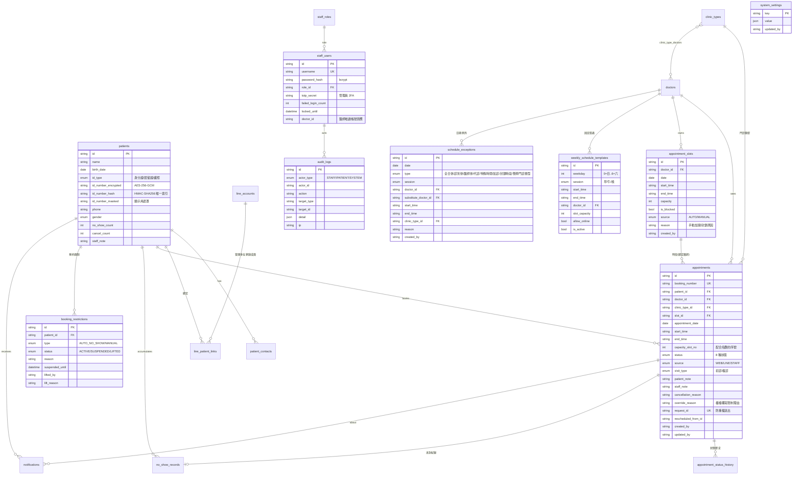

# 03｜資料庫 ERD

實際欄位定義以 `prisma/schema.prisma` 為準；partial unique index 等 PostgreSQL 特有約束見 migration SQL。



## 資料庫層級約束（migration 內 raw SQL）

```sql
-- 同一醫師同一時段：capacity_slot_no 在交易內依 FOR UPDATE 鎖依序配發，
-- unique index 為第二道防線（有效狀態才占用名額）
CREATE UNIQUE INDEX "uniq_active_doctor_slot_seq"
  ON "appointments" ("doctor_id", "appointment_date", "start_time", "capacity_slot_no")
  WHERE "status" IN ('PENDING','CONFIRMED','CHECKED_IN','COMPLETED','NO_SHOW');

```

- 取消（病人取消/診所取消/已改期）的預約不符合 WHERE 條件 → 立即釋放名額、不計同日限制。
- 預約建立、改期、取消皆包在 `prisma.$transaction` 中，並先 `SELECT … FOR UPDATE` 鎖定時段列與病人列，高併發時序列化，避免超賣（併發測試驗證）。
- **同日唯一**與 **7 天 3 筆**由交易內「鎖定病人列 → 計數檢查」強制，不用 unique index——因櫃檯管理員可輸入理由特殊覆寫，唯一索引無法表達例外；病人列鎖已序列化同一病人的併發請求，無競態漏洞。

## 輔助資料表（規格外新增）

| 表 | 用途 |
|---|---|
| `line_patient_links` | 一個 LINE 帳號綁多位家庭成員（含驗證時間） |
| `otp_codes` | 手機驗證碼（雜湊儲存、限次數、限時效） |
| `portal_sessions` | 民眾登入 session（token 雜湊） |
| `staff_sessions` | 員工登入 session（token 雜湊、閒置逾時） |
| `clinic_type_doctors` | 門診類型可接受的醫師 |
